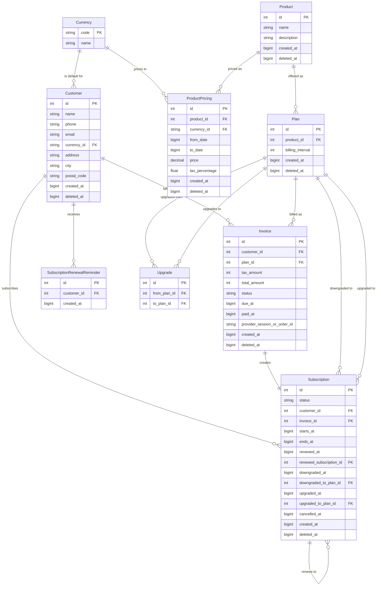

```mermaid
---
config:
  theme: default
---
erDiagram
    Currency ||--o{ Customer : "is default for"
    Currency ||--o{ ProductPricing : "prices in"
    Customer ||--o{ Invoice : "billed to"
    Customer ||--o{ Subscription : "subscribes"
    Customer ||--o{ SubscriptionRenewalReminder : "receives"
    Product ||--o{ ProductPricing : "priced as"
    Product ||--o{ Plan : "offered as"
    Plan ||--o{ Invoice : "billed as"
    Plan ||--o{ Upgrade : "upgrades from"
    Plan ||--o{ Upgrade : "upgrades to"
    Invoice ||--|| Subscription : "creates"
    Subscription ||--o{ Subscription : "renews to"
    Plan ||--o{ Subscription : "downgraded to"
    Plan ||--o{ Subscription : "upgraded to"
    Currency {
        string code PK
        string name
    }
    Customer {
        int id PK
        string name
        string phone
        string email
        string currency_id FK
        string address
        string city
        string postal_code
        bigint created_at
        bigint deleted_at
    }
    Product {
        int id PK
        string name
        string description
        bigint created_at
        bigint deleted_at
    }
    ProductPricing {
        int id PK
        int product_id FK
        string currency_id FK
        bigint from_date
        bigint to_date
        decimal price
        float tax_percentage
        bigint created_at
        bigint deleted_at
    }
    Plan {
        int id PK
        int product_id FK
        int billing_interval
        bigint created_at
        bigint deleted_at
    }
    Invoice {
        int id PK
        int customer_id FK
        int plan_id FK
        int tax_amount
        int total_amount
        string status
        bigint due_at
        bigint paid_at
        string provider_session_or_order_id
        bigint created_at
        bigint deleted_at
    }
    Subscription {
        int id PK
        string status
        int customer_id FK
        int invoice_id FK
        bigint starts_at
        bigint ends_at
        bigint renewed_at
        int renewed_subscription_id FK
        bigint downgraded_at
        int downgraded_to_plan_id FK
        bigint upgraded_at
        int upgraded_to_plan_id FK
        bigint cancelled_at
        bigint created_at
        bigint deleted_at
    }
    Upgrade {
        int id PK
        int from_plan_id FK
        int to_plan_id FK
    }
    SubscriptionRenewalReminder {
        int id PK
        int customer_id FK
        bigint created_at
    }
```