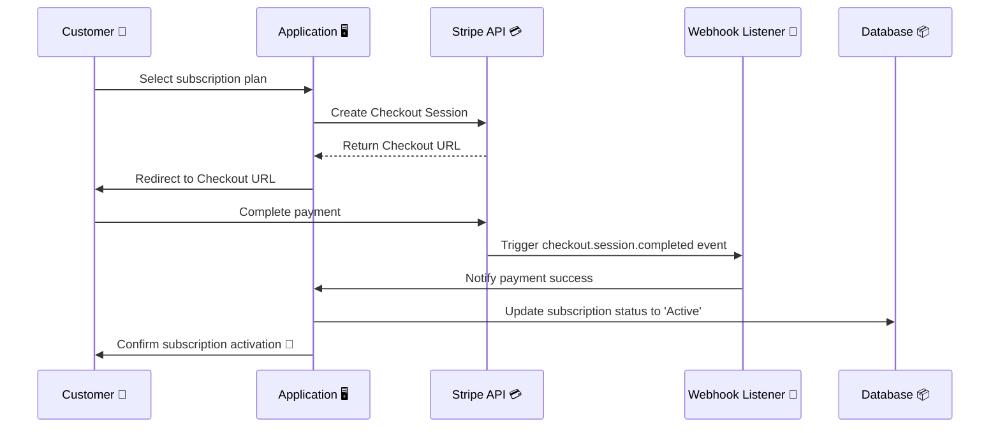

```mermaid
---
config:
  theme: default
---
sequenceDiagram
    participant C as Customer 🤵
    participant A as Application 🖥️
    participant S as Stripe API 💳
    participant W as Webhook Listener 📡
    participant DB as Database 📦
    C->>A: Select subscription plan
    A->>S: Create Checkout Session
    S-->>A: Return Checkout URL
    A->>C: Redirect to Checkout URL
    C->>S: Complete payment
    S->>W: Trigger checkout.session.completed event
    W->>A: Notify payment success
    A->>DB: Update subscription status to 'Active'
    A->>C: Confirm subscription activation 🎉

```